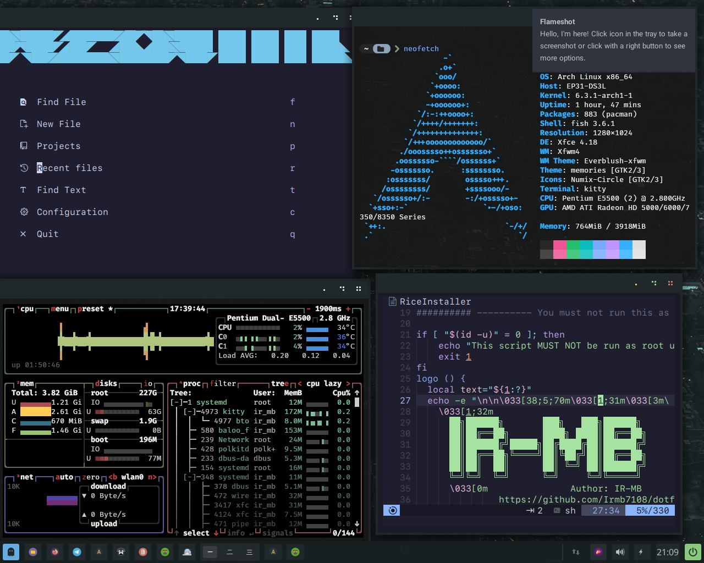

# my-xfce
Xfce Dotfile Project for Arch Linux

This project consists of dotfiles for configuring the Xfce desktop environment on Arch Linux. By utilizing these dotfiles, you can enhance the aesthetics and functionality of your Xfce user interface.
Installation and Setup

To utilize these dotfiles and configure the Xfce desktop environment, follow the steps below:

**Clone the repository:**
```
git clone https://github.com/Irmb7108/my-xfce.git
```
**Transfer the dotfiles:**
```
    cd my-xfce
    cp -r .assets ~/.
    cp -r .config/xfce4/ ~/.config/
```
icons:

```
yay -S nordzy-icon-theme-git
``` 

 Restart the Xfce desktop environment.
TELEGRAM DESKTOP THEMES 
```  https://t.me/addtheme/uEoDB43jJHAxgqND ```
Customization

You have the freedom to customize the dotfiles according to your preferences. By editing these files, you can tailor the appearance and functionality of the Xfce desktop environment to suit your needs.
Contribution

If you're interested, you're welcome to contribute to the improvement and development of this project. Please report any ideas, suggestions, or issues in the GitHub repository's Issues section.
License

This project is licensed under the MIT License.

